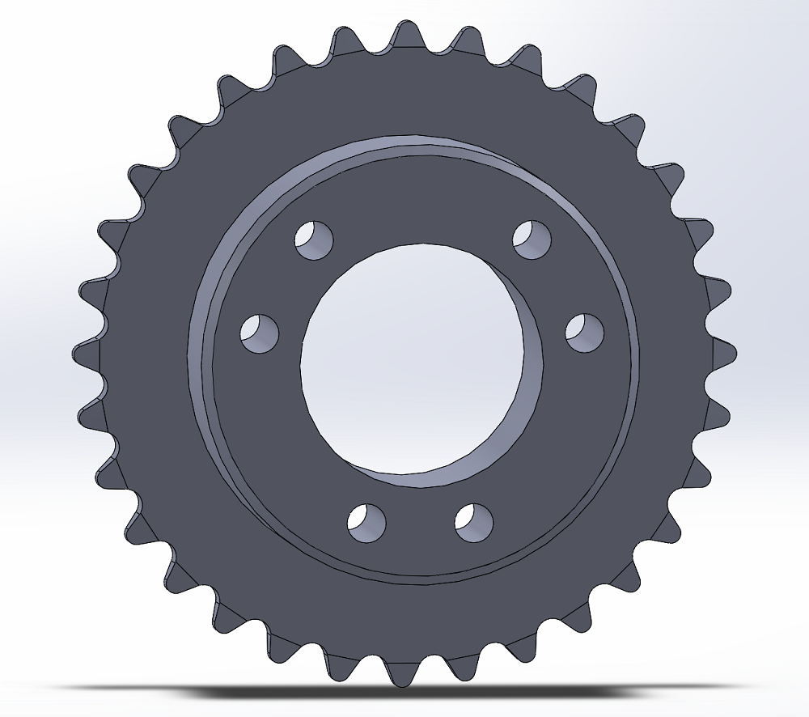
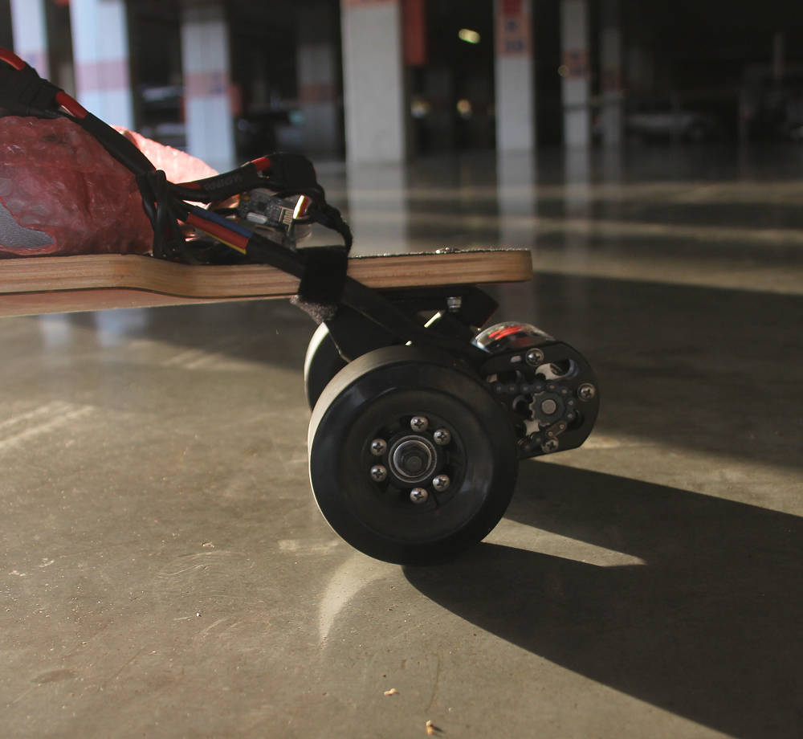
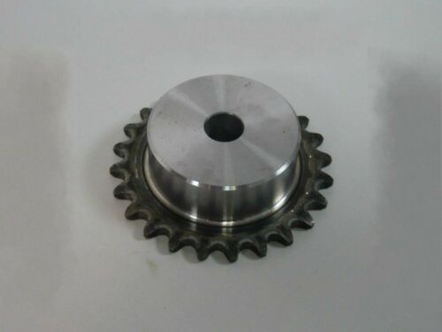
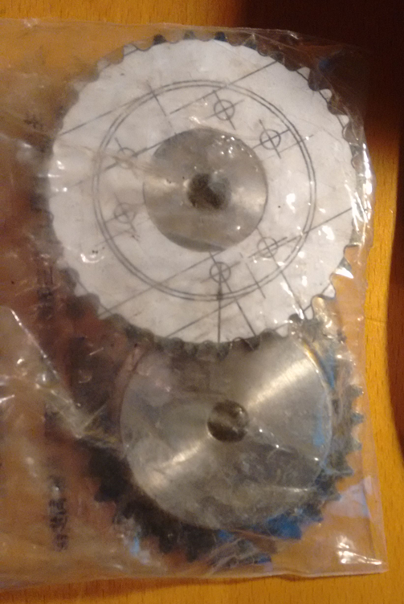
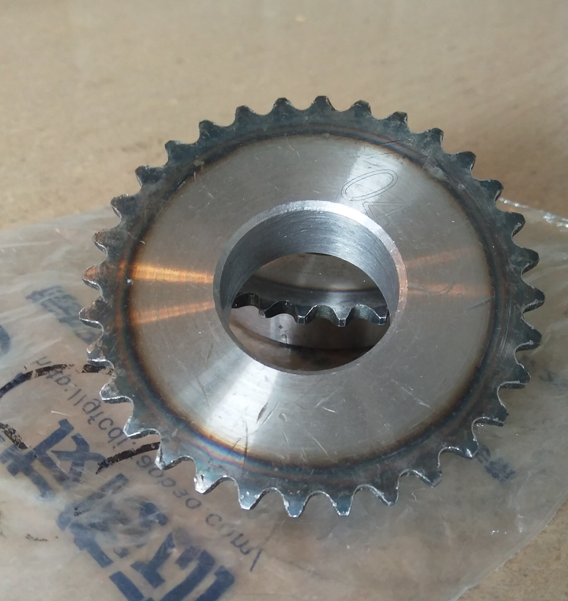
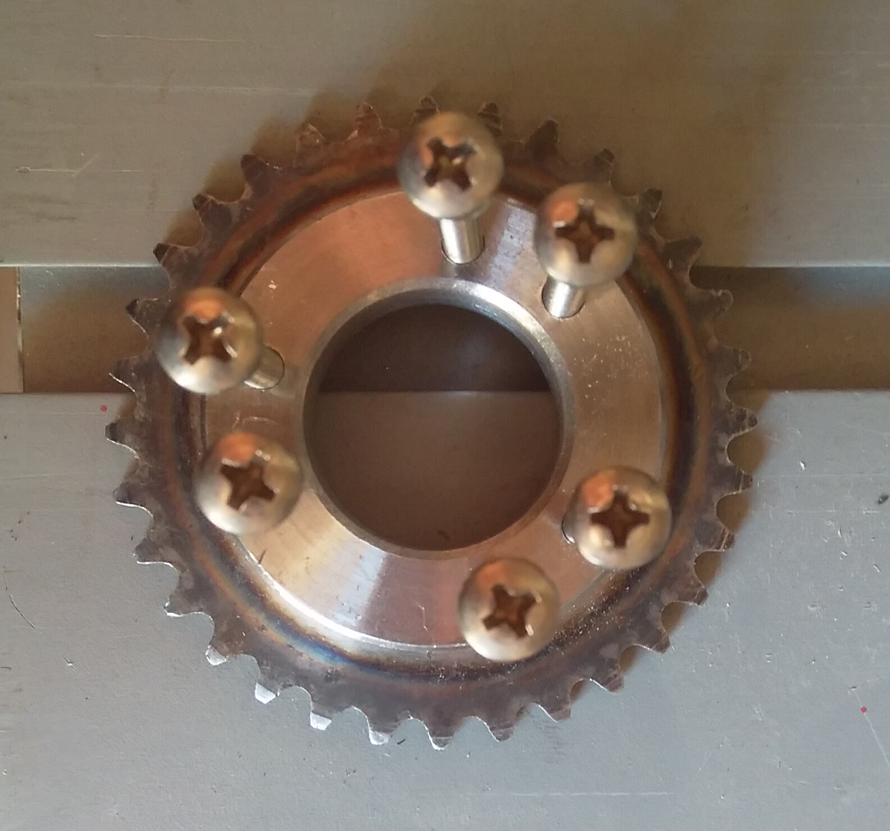
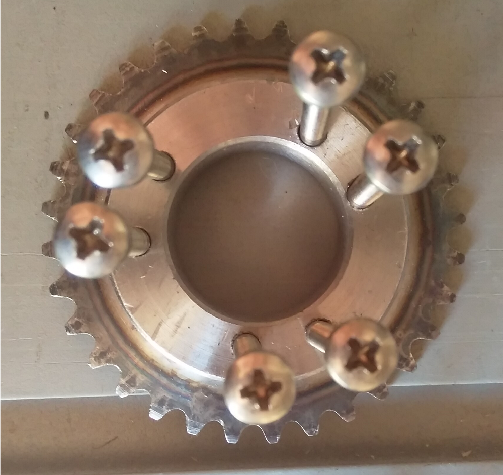
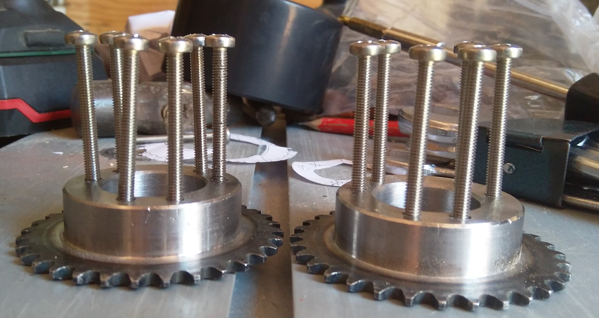

# longboard-sprocket

SolidWorks files for machining a chain sprocket for an electric longboard with CAL 7 wheel cores.

Parts:
* 1 x Sprocket  - Ebay, can be found by searching for "32T 6.35mm sprocket"
* 6 x Bolts     - M4 x 50 DIN7985/ISO7045 stainless steel A2
* 6 x Nuts      - self locking, stainless steel

## Build

Source sprocket bought on Ebay, can be found by searching for "32T 6.35mm sprocket"

The technical drawing in the PDF can be printed on an A4 sheet and the dimensions should match 1:1

The inner hole can be enlarged with a lathe

Proper alignment is paramount  when drilling bolt holes

Or sprocket will not be usable

  
